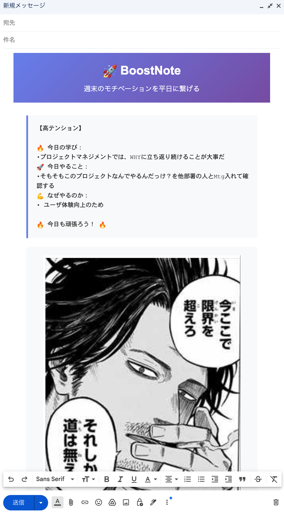

# BoostNote

週末の学習により沸いたモチベーションを平日に繋げる!!

https://github.com/user-attachments/assets/9cf0263c-de33-41c1-af5c-70f076fe82f8

## ユーザーストーリー
**ユーザーは、休日に決めたTODO、やる理由を書いたメールを、期待を込めて平日朝の自分に送る。**

**平日朝の自分はそれを確認することで、モチベーションを再度呼び起こす。**

⇩送信されるメール


## 機能

- 📝 学習内容、TODO、やる理由を入力
- 🎯 テンションレベルに応じたメールテンプレート生成
- 🖼️ モチベーション画像の表示
- 📋 メール用HTMLとしてコピー（デザイン付き）
- 💾 フォーム内容の自動保存（localStorage）

> [!NOTE]
> **画像の利用について**
> 
> - このアプリケーションは個人のローカル環境での使用を想定しています
> - 画像ファイルは`.gitignore`で除外されており、リポジトリには含まれません
> - 著作権のある画像を配信・使用する場合は、適切な権利処理を行ってください

## 使い方

### 1. 必要な環境

**Python**: 3.6以上（推奨: 3.8以上）

※開発者は3.11.13環境で動作確認しました。

```bash
# Pythonバージョン確認
python3 --version

# 必要要件（標準ライブラリのみ使用）
# requirements.txt を参照
```

### 2. 画像の設定

`images/`フォルダに好きな画像を入れてください

🚀 🚀 モチベが上がるものを入れましょう🚀 🚀 

**対応形式**: JPG, JPEG, PNG, GIF, WebP, SVG

**注意**: `images/`フォルダは`.gitignore`で除外されているため、画像はローカルでのみ使用されます。

### 3. サーバ起動

```bash
# Pythonサーバーを起動
python3 server.py

# または、ポートを指定して起動
python3 server.py -p 8080

# ヘルプ表示
python3 server.py --help
```

サーバーが起動すると、以下のURLでアクセスできます：
- アプリ: `http://localhost:8000/index.html`
- 画像API: `http://localhost:8000/api/images`
- 画像例: `http://localhost:8000/images/your-image.jpg`

**画像の自動検出**: `images/`フォルダ内の画像は自動的に検出され、ランダムで表示されます。

### 4. アプリケーションの使用

1. ブラウザで `http://localhost:8000/index.html` を開く
2. 学習内容、TODO、やる理由を入力
3. テンションレベルを選択
4. 「メール内容を生成」ボタンをクリック
5. 生成された内容と画像をコピー

## ファイル構成

```
boostnote/
├── index.html              # メインHTMLファイル
├── server.py               # 画像配信サーバー（ローカル開発用）
├── requirements.txt        # Python必要要件
├── .gitignore              # Git除外設定
├── images/                 # 画像ファイル（.gitignoreで除外）
│   └── your-images.jpg     # ユーザーが配置する画像
├── scripts/
│   ├── app.js             # メインアプリケーション
│   ├── contentGenerator.js # メール内容生成
│   └── localStorage.js    # データ保存管理
└── styles/
    └── main.css           # カスタムスタイル
```

## 技術仕様

- **フロントエンド**: Vanilla JavaScript, HTML5, Tailwind CSS
- **バックエンド**: Python 3.6+ (標準ライブラリのみ)

